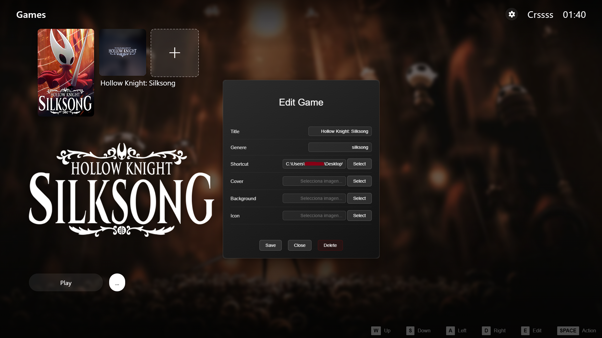
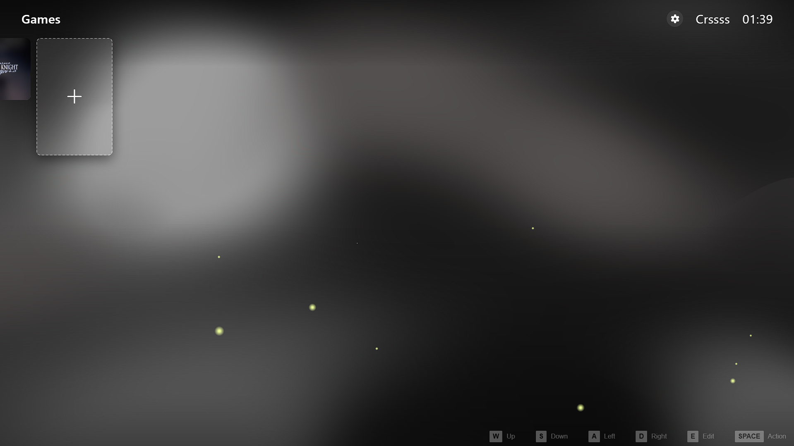

# 🎮 Exodus Launcher

A customizable game launcher inspired by the PlayStation 5 interface, built with Electron, HTML, CSS, and JavaScript.
### It lets you organize, personalize, and launch your favorite games in an elegant, fast, and visually rich way ✨

### 🚀 Features
* 🖼️ PS5-inspired UI with smooth animations and a horizontal game gallery.
* 🌐 Multi-language (i18n) support.
* 🧠 Local library system stored.
* 📎 Supports shortcuts / executables / URLs (e.g., Steam, Epic, etc).
* 🧰 Admin panel to:
  * Add new games with custom cover, background, and logo images.
    
  * Edit existing entries.
    
  * Automatically reorder recently played games to the top.
* ⚙️ Configuration menu
  
  * Username
  * Language (En/Es)
  * Controls
  * Background Colors
* 🌌 Configurable background colors.
  
* 🔄 Dynamic UI reload after edits — no restart required.

## 🎮 Controls (Customizable)

- **SPACE** → Launch selected game or Add a New Game
- **E** → Edit selected game  
- **A / D** → Navigate through games
- **W / S** → Navigate through navbar/games

### 📝 License

__This project is released under the MIT License.__

__You are free to use, modify, and distribute it — but reselling is prohibited without explicit permission.__
